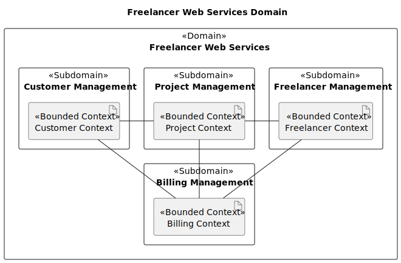
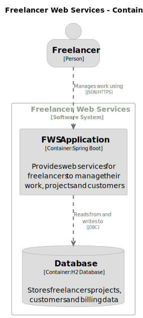
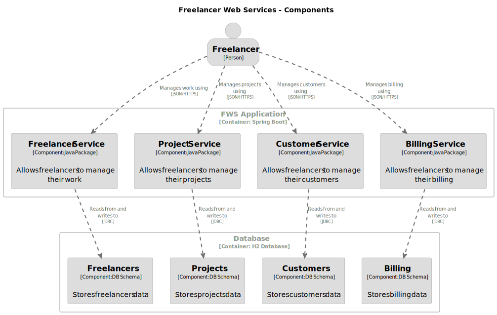
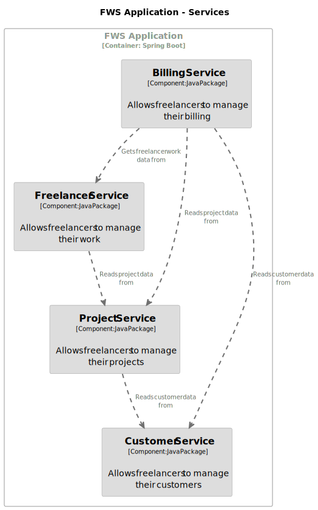

# Documentation

The Freelancer Web Services (FWS) system is designed and documented using Domain Driven Design (DDD) and the [C4 model](https://c4model.com/). Following the C4 model principles the system is described at different levels of abstraction, starting from the big picture and drilling down to the details.

## Domain

This fictional system is based on the [Domain-Driven Design Example by Mirko Sertic](https://www.mirkosertic.de/blog/2013/04/domain-driven-design-example/) and offers information and management services that help freelancers to manage their business.

## Architecture

Currently the high-level architecture of the system is simple, so we are skipping the Context diagram and going directly to the Containers diagram:

In this early stage of the project, the system is implemented as a modular monolith, where each bounded context is a module that implements a different service:

Services are implemented as Java packages and they follow the styles and principles described in the [Reference Architecture](reference_architecture.md) and the [Architecture Decision Records](adr/README.md):

Follow these links to learn more about each service:

- [Freelancer Service](freelancer_service.md)
- [Project Service](project_service.md)
- [Customer Service](customer_service.md)
- [Billing Service](billing_service.md)
