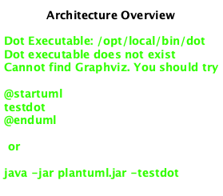

# Reference Architecture

Freelancer Web Services (FWS) is an information system designed to handle complex business processes by integrating several architectural styles, the following picture offers an overview of how those styles are combined to create a reference architecture for the system:

## Domain-Driven Design (DDD)
DDD is the foundation of the system's architecture, ensuring that the system is always organized around the business domain.
  - **Bounded Contexts**: The system is divided into bounded contexts, each representing a distinct part of the business domain (aka subdomain). Each context has its own domain model and logic, ensuring that models are consistent within their boundaries.
  - **Domain Models**: The core logic is modeled after domain concepts and encapsulated in the domain layer of each bounded context, where other contexts cannot directly access it.
  - **Anticorruption Layers**: Anticorruption layers are used to protect the integrity of the domain model when integrating with external systems and with other bounded contexts.

Please keep in mind that the first step to implement new functionalities is to identify the bounded context that needs to be created or updated.

## Layered Architecture
Within each bounded context, the system follows a layered architecture to separate technical concerns:
  - **Application Layer**: Hosts API Controllers that orchestrate and coordinate interactions between domain abstractions and infrastructure services to implement use cases and application logic. Using the Spring Framework we leverage the application layer annotating its components to expose the RESTful API.
  - **Domain Layer**: Encapsulates the domain logic. This layer is independent of other layers and should remain as pure as possible, no framework or library dependencies should be used here.
  - **Infrastructure Layer**: Manages technical concerns like data persistence, messaging, and external APIs. It implements domain abstractions that have technical dependencies, like those that depend on data access, external systems or other bounded contexts.

## Modular Monolith
The system is implemented as a modular monolith, where each bounded context is a module that encapsulates its own application logic, domain logic and infrastructure code. Each module is implemented as a separate package and can be developed and maintained independently. If data storage is required, the module should have its own database schema; although all the schemas are managed by the same database instance.

As a monolith, the system is deployed as a single unit, but it can scale horizontally by adding more instances of the monolith, and it can evolve into microservices if needed.

## SOA & RESTful APIs
Bounded contexts are designed to expose their capabilities as services, following the principles of [Service-Oriented Architecture (SOA)](https://aws.amazon.com/what-is/service-oriented-architecture/). These services are accessible to external clients through RESTful APIs that are resource-oriented, use HTTP verbs and have hypermedia controls to guide clients through the application's state transitions; review the [Richardson Maturity Model](https://martinfowler.com/articles/richardsonMaturityModel.html) for more details.
